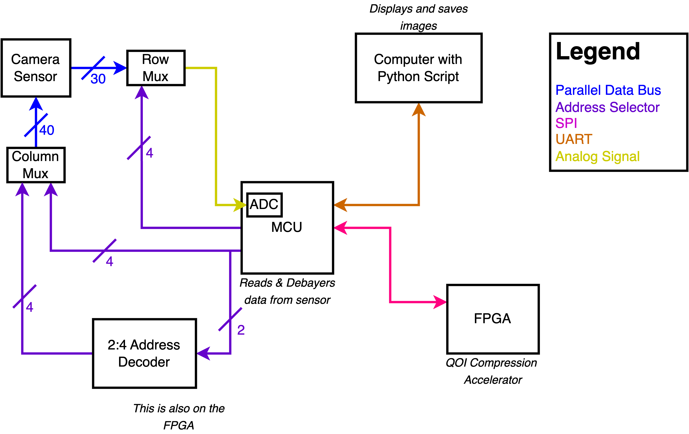

# Project Abstract

NeoObscura is a fully functional camera sensor with on-device image compression built from scratch using an array of 1,200 phototransistors. The MCU reads data from the sensor array, one phototransistor at a time. Once a full image is read, it is sent to the FPGA over SPI to be compressed. The compressed image is sent back to the MCU which will sends over UART to a laptop which interprets and displays the image.

    <iframe width="262" height="467" src="https://www.youtube.com/embed/lJYW2ZMiyLE" title="NeoObscura: A completely from scratch image sensor with QOI Compression" frameborder="0" allow="accelerometer; autoplay; clipboard-write; encrypted-media; gyroscope; picture-in-picture; web-share" allowfullscreen></iframe>

# Project Motivation
Nearly everyone carries around a smartphone capable of taking high resolution photos and videos, but few people truly understand how a digital camera works. In this project, we aim to learn about the entire process of generating an image, from photon to disk. We want to design and build each part of the camera from scratch: the lens and body, sensor, image processor, and compressor. By creating a simple, modular camera system we hope everyone can get a better understanding of how they work.

# System Block Diagram

# Table of Contents
#### [MCU Design]({{ site.baseurl }}/mcu_design/)

Explanation of everything the MCU does: reading data from the sensor, image processing, interfacing with the FPGA QOI compression accelerator, sending data to the laptop.

#### [FPGA Design]({{ site.baseurl }}/fpga_design/)

Explanation of QOI Hardware accelerator implementation.

#### [Results]({{ site.baseurl }}/results/)

Summary of the core results of our project.

#### [Documentation]({{ site.baseurl }}/doc/)

Useful pieces of documentation including: schematics, the BOM, references, and sources of inspiration.

#### [Team]({{ site.baseurl }}/team/)

Who we are

#### [Media]({{ site.baseurl }}/media/)

Images and videos showing our project in action